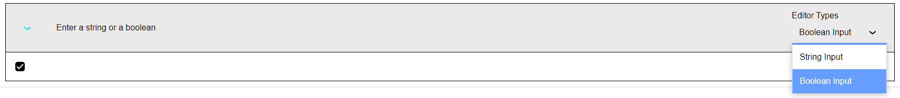
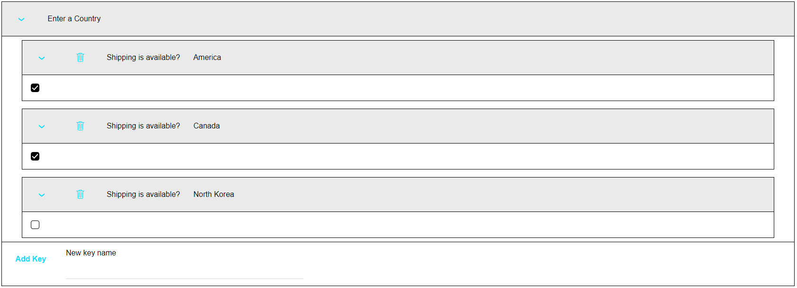
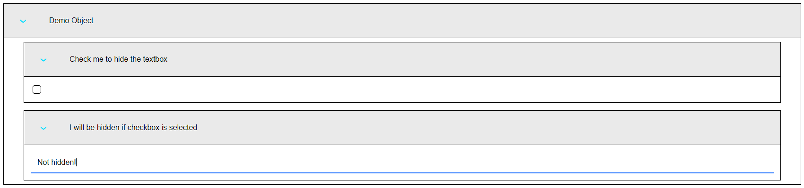

# Alpha Anywhere Generic JSON Builder

## Overview
This component is meant to provide the **blueprint** for a JSON form so that an end user can easily fill it out using a UI. To build this blueprint, two main classes are provided.

### `Value` Class
The `Value` class represents a single JSON value that can be entered into the form. Valid values are:
- Strings
- Numbers
- Booleans
- Functions
- Objects
- Arrays

The `Value` class has a single constructor taking two parameters.
- `type`
    - The type of value
    - Can be `'string'`, `'number'`, `'boolean'`, `'function'`, `'object'`, or `'array'`.
- `options`
    - Object with options to configure the different inputs

`options` follows this general format.
```js
{
    // Valid for all input types
    // (where value is some JSON value)
    default: value,
    
    // ONLY VALID FOR 'object' TYPES
    // -------------------------------------------------------------

    // Mandatory
    // These keys will *always* appear in the JSON form
    staticKeys: {
        key1: Input(...),   // See next section for Input
        key2: Input(...),
        ...
    },

    // Optional
    // If defined, the user can add arbitrarily named keys
    // The values will follow the Input blueprint described here
    dynamicKeys: Input(...),

    // Optional 
    // If true, this component will open in a new tab. It will
    // instead nest itself inside its parent.
    inline: true,

    // -------------------------------------------------------------
    

    // ONLY VALID FOR 'array' TYPES
    // -------------------------------------------------------------
    
    // Mandatory
    // User can add elements to an array
    // The added elements will follow this blueprint
    arrayInput: Input(...),

    // Optional 
    // If true, this component will open in a new tab. It will
    // instead nest itself inside its parent.
    inline: true,

    // -------------------------------------------------------------
}
```


### `Input` class
The input class represents an abstract piece of data. 

For example, we might want an input that represents some template. This template can be a static string **or** an arbitrary function. Conceptually, these are both the same abstract thing: a template. However, they are represented by two different input types.

The `Input` constructor takes one value, an `options` object, following 
this format.

```js
{
    // Mandatory
    // Each item in this array represents a possible value that 
    // the user can supply to satisfy this Input
    values: [
        {
            value: InputType(...),
            dropdownLabel: 'label 1',
        },
        {
            value: InputType(...),
            dropdownLabel: 'label 2',
        },
        ...
    ],

    // Mandatory
    // Label to show above input field
    label: 'label value',

    // Mandatory 
    // Comments, hints, or tips to show to the user about this field
    comments: 'comments here',

    // Mandatory
    // Function to validate user-supplied data 
    // Throw error if invalid
    validate: (value) => { ... },

    // Optional
    // Function to compute whether this component should be shown 
    // Return true for show, false for hide
    // Takes a reference to `inputObj`, 
    // which is the object we are currently defining
    show: (inputObj) => { ... },
}
```

The `Input` object also has two static helper functions.
- `singleInput(type, label, valueOptions, inputOptions)`
    - Arguments
        - `type`: string, corresponds to `Value` type
        - `label`: string, used in label field
        - `valueOptions`: options to pass to `Value` constructor
        - `inputOptions`: optional, can specify fields like `show` or `comments`
    - This function returns an instance of `Input` with one single element in the `values` array, saving a lot of boilerplate typing.

- `singleType(value)`
    - Arguments
        - `value`: instance of `Value`
    - Returns a `values` array with a single entry containing `value`.


## Examples

### Single String/Boolean/Number/Function Input
```js
let myForm = new Input({
    values: [{
        value: new Value('string'),
        dropdownLabel: '',
    }],
    label: 'My String Input',
    comments: '',
    validate: () => true,
});

// Alternatively, using the singleInput helper,
let myForm = Input.singleInput('string', 'My String Input');
```
#### Result


The same process goes for booleans, numbers, and functions. The only change would be swapping 
out `'string'` for `'boolean'` or whichever other input type you want.

---

### Single Object Input with No Dynamic Keys

```js
let myForm = new Input({
    values: Input.singleValue(new Value('object', {
            staticKeys: {
                key1: Input.singleInput('string', 'Key1 String Input'),
                key2: Input.singleInput('boolean', 'Key2 Boolean Input'),
            }
        })
    ),
    label: 'My object input',
    comments: '',
    validate: () => true,
});

```
#### Result


---

### Single Array Input
```js
let myForm = new Input({
    values: Input.singleValue(new Value('array', {
        arrayInput: Input.singleInput('string', 'String array element'),
    })),
    label: 'My array input',
    comments: '',
    validate: () => true,
});
```
#### Result


--- 

### Input with Multiple Options
Say we want to model a JSON form that allows either a string *or* a boolean.

```js
let myForm = new Input({
    values: [
        {
            value: new Value('string'),
            dropdownLabel: 'String Input',
        },
        {
            value: new Value('boolean'),
            dropdownLabel: 'Boolean Input'
        }
    ],
    label: 'Enter a string or a boolean',
    comments: '',
    validate: () => true,
});
```
#### Results 



--- 

### Object with Dynamic Keys
Say our JSON data is of the form `{countryName1: boolean, countryName2: boolean, ...}`, maybe representing whether or not shipping is available. Obviously, it is impractical (and in some situations, impossible) to 
input every single possible key value statically. So, we use *Dynamic Keys*, which allow a user to input their own key value. Dynamic Keys are associated with a particular 
input, which will be copied to each new dynamic key.

```js
let myForm = Input.singleInput('object', 'Enter a Country', {
    staticKeys: {},
    dynamicKeys: Input.singleInput('boolean', 'Shipping is available?')
});
```

#### Results



---

### Default Values
Say we want a text field that defaults to the number `0` if no text is entered.
```js
let myForm = new Input({
    values: Input.singleValue(new Value('string', {
        default: 0,
    })),
    label: 'Enter a value (optional)',
    comments: '',
    validate: () => true,
});
```
When serialized, if no value was input, we will get `0`.

---

### Show/Hide Expressions 
Say we have an object with a field that should be hidden if another field's checkbox 
is selected.

In this example, we make use of the `parent` field of our `Input` object, which (as you might expect) points to the parent of our object.

```js
let myForm = Input.singleInput('object', 'Demo Object', {
    staticKeys: {
        checkbox: Input.singleInput('boolean', 'Check me to hide the textbox'),
        textbox: new Input({
            values: Input.singleValue(new Value('string')),
            label: 'I will be hidden if checkbox is selected',
            comments: '',
            validate: () => true,
            show: (inputObj) => {
                // Select the parent of this textbox, which 
                // is the 'Demo Object' object
                let p = inputObj.parent;
                if (p) {
                    // Recall that Inputs can have multiple values. 
                    // Therefore, we need '.selected()' to select this specific value.
                    // 'checkbox' field will be true or false.
                    return !p.selected().key('checkbox').serialize();
                }
                return false;
            }
        })
    }
});
```




--- 

### Comments 
If your data requires some explanation, it might be useful to leave a comment. 
These are specified per-input. 
```js
let myForm = Input.singleInput(
    'string', 
    'String With Comment', 
    {},
    {comments: 'Some useful information here!'}
);
```
Note that we are using the `singleInput` function, which expects *value options* as the third argument. We have no value options, so we just pass in an empty object.


--- 

### Validation 
Sometimes, specifying the type of the input isn't enough. The `validate` function accepts serialized data and allows you to perform your own checks on it. If the data does not pass, throw an error.

```js
let myForm = Input.singleInput(
    'string',
    'Enter any string but "Hello"',
    {},
    {
        validate: (data) => {
            if (data === 'Hello') 
                throw new Error('Value cannot be "Hello"')
        }
    }
);
```
If the user enters bad data, they will be shown an error message when they attempt to save the form. 
